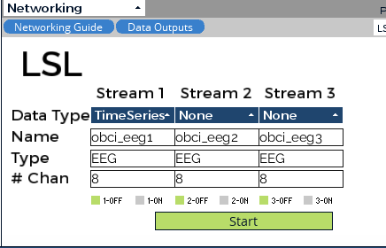
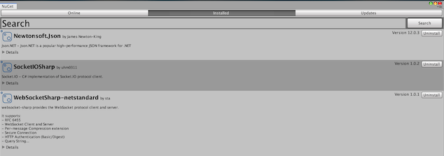

# Connecting to Unity

## In OpenBCI
1. In DATA SOURCE choose PLAYBACK(from file)
1. Click SELECT PLAYBACK FILE and choose the .txt included in this folder
1. Click START SESSION
1. Switch the Acceleration window in the bottom left hand corner to Networking
1. Run with the following networking settings\

1. Press Start in the Networking window and Start Data Stream in the top left hand corner

## Running the Demo
1. Run ```python app.py``` in python-socket-io-server folder

## In Unity
1. Install SocketIOSharp (can be done via NuGet package manager extention for Unity)

1. Go to the Game tab and press play

